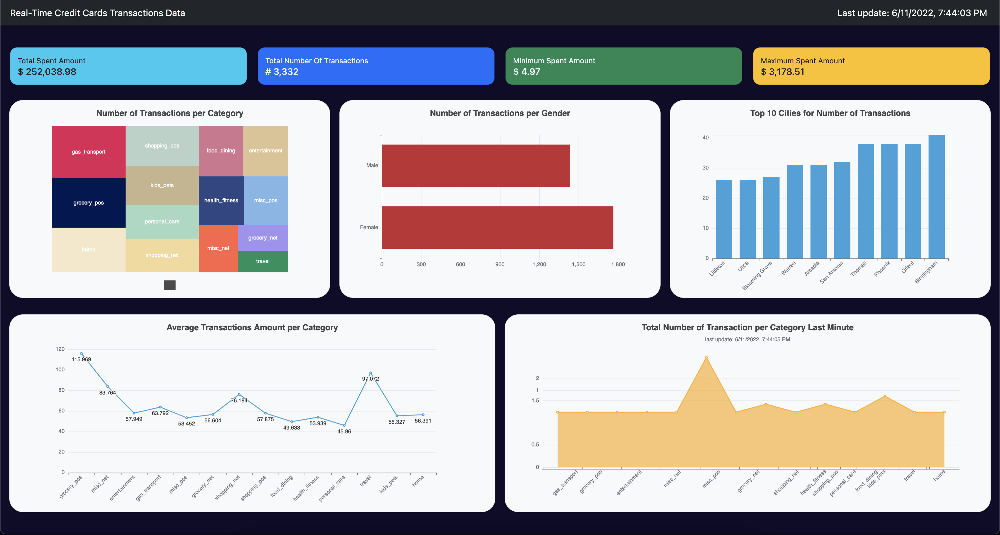
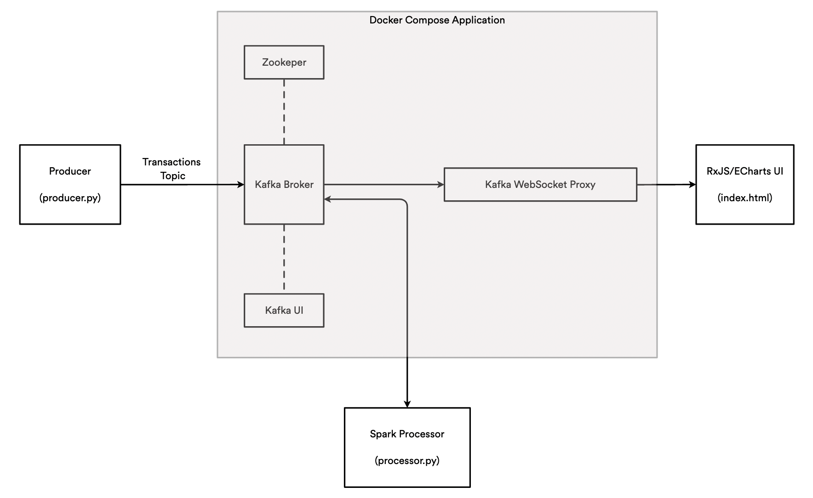

# Real-Time Credit Card Transactions Analysis



## Overview

The purpose of this project is to build a system that analyzes transaction data in the form of a stream and proposes a summary dashboard of the analysis conducted. The analysis is performed using the Apache Spark framework, in particular the Spark Streaming extension. To manage the streams we use Apache Kafka and in order to build the final dashboard we combine Boostrap, Apache ECharts and RxJS.

The following image depicts the system architecture and all the components:



## Data Sources

Due to privacy-related issues, finding real-time streams of real transactions is hard and the same is true for real transactions performed in the past (sources not in real time). To overcome this lack of data and still be able to develop an application, we will use a transaction dataset generated by a data generator.

Accordingly with the creator of the dataset hosted on Kaggle, the generator used is presented on GitHub in a repository named Sparkov Data Generator and was created for a project called Sparkov, *A Markov-Chain based fraud detection system based in Spark*.

According to the code, in order to generate data, first is necessary to create a customer file and then this file can be used to generate the actual transactions. The generator uses a pre-defined list of merchants and transaction categories. The customer file, containing customer-related data, is generated using a Python library called *Faker*. After the generation of the customers data, it is necessary to select a *profile*, a file that contains some behavioural attributes proper to demographics aspects of the customers. These attributes are defined in terms of minimum and maximum transactions per day, distribution of transactions across days of the week and normal distribution properties (mean, standard deviation) for amounts in various categories. According to the selected profile, the transactions are generated again using *Faker*. An example of profile is named *adults_2550_female_urban.json* and represent behaviours of adult females in the age range of 25-50 who are from urban areas.

As reported by the creator of the dataset, transactions have been generated across all profiles and then merged together to create a more realistic representation of real transactions. The transactions are generated in a time interval that ranges from 1 Jan 2019 to 31 Dec 2020.

The dataset in question is presented in CSV format and can be found on kaggle. This dataset contains more than one million transactions records with related information. The original version of the data contains several attributes, but only a few will be considered for the purpose of the project. In particular, the attributes that will be considered are:

1. ID
2. Category of the transaction
3. Amount of the trasaction
4. Gender of the credit card holder
5. City of the credit card holder
6. State of the credit card holder
7. City Population of the city of the credit card holder
8. Job of the credit card holder
9. Unixtime as the timestamp of the transaction

In order to simulate a real-time stream of data we make use of a custom Python file, called `producer.py` that "converts" the tabular data into a stream-like source, sending json messages to a Kafka topic. What this script does is reading line by line the transactions from the dataset, selecting the attributes of interest, parsing this attributes in a json structure and send this json structure to Kafka respecting the timestamp attached to each transaction. In this way we simulate transactions happening in real time and, at the same time, we respect the original time attribute attached to each transaction.

## Technologies and Overall Architecture

1. **Producer**: This Python file is used to convert a csv file in a stream of data, simulating a real time source. Sends out json data to a Kafka topic, named ”Transactions”.
2. **Kafka + ZooKeeper + Kafka UI**: This components are used together in order to store topics into Kafka. The stored topics are both original topics and topics resulting from processing steps. Kafka UI Docker Image provides a practical user interface, useful to monitor all the topics. The Kafka UI Docker Image dashboard can be accessed from *http://localhost:28080/*.
3. **Spark**: The Spark framework is used to analyze the stream of data and create new topics. These new topics represent the results of the query. In particular, we make use of the Spark Streaming extension and the Spark SQL language. The results of the queries are pushed back to Kafka in new topics, one for each query.
4. **Kafka WebSocket proxy**: This component is a WebSocket proxy that allows JavaScript code to produce and consume messages from topics in Kafka.
5. **RxJS + ECharts + Bootstrap**: This components are used in order to build the final dashboard presented to the user. In particular, we use RxJS to get data from the Kafka Proxy and update the page in real time, Bootstrap to build the page structure and pagination, Apache ECharts to generate the proposed visualizations. The dashboard can be accessed opening the `index.html` file.
6. **Docker**: The Docker Compose is used to manage all the components, except for the producer and the processor Python files that must be started from the command line, by hand.


## Application Workflow

1. The processor reads the data in the CSV file and sends this data row by row as a stream source to a Kafka topic, named `transactions`. This topic is accessed from the processor. 
2. The processor is responsable for reading the messages from the `transactions` topic and compute analytical queries, using the Spark Streaming extension and Spark SQL. 
3. The results of the queries are sent again to Kafka in dedicated topics. 
4. These topics are then acessed from the `index.html` using the Kafka Websocket Proxy and the RxJS extension. 
5. At the end, the visualization on the dashboard are updated in real time.


## Running the Application

This application was developed and tested is osx-arm64 and it may be necessary to install / remove additional libraries to make the application work on other platforms.

* The first step is to make sure to have all the requisites necessary to use the application. To simplify this operation we can create a new virtual environment and install the required libraries. The `conda_env.txt` file contains all the required libraries in a format that is ready to install in an Anaconda Virtual Environment. Check also that JAVA_HOME points to a Java 8 to 11 JRE/JDK (a custom JAVA_HOME variable can be set inside the conda environment, if necessary)

This operation can be done from the Command Line Interface (CLI) with the following command:
```bash
$ cd PROJECT/
$ conda create --name kafka-env --file conda_env.txt
$ conda activate kafka-env
```

* The second operation to be performed is to start the Docker composer, which will take care of loading the components needed by the application. Also this operation is done from the CLI, with the following command:

```bash
(kafka-env) $ cd PROJECT/
(kafka-env) $ docker compose up
```

* Next, we have to launch the producer, which is in charge of transforming the transactions file into a data stream that is sent to Kafka. It is possible to specify how fast the data is forwarded to Kafka with the `speed` attribute: if set to "1" (default) the transactions will be issued respecting the timestamp attached to them, with higher values, the emission speed will increase. Useful option in debugging to see graphs updating very often. Another option that can be applied regards the Kafka server Bootstrap Server setting (default: *localhost:29092*).

Start the producer from the CLI using:
```bash
(kafka-env) $ cd PROJECT/bin/
(kafka-env) $ python producer.py
```

Start the producer at faster speed:
```bash
  (kafka-env) $ cd PROJECT/bin/
  (kafka-env) $ python producer.py --speed 10
```

Start the producer with a specific Bootstrap Server:
```bash
  (kafka-env) $ cd PROJECT/bin/
  (kafka-env) $ python producer.py --boostrap-server localhost:29092
```

The processor must be started via CLI, using the command:
```bash
  (kafka-env) $ cd PROJECT/bin/
  (kafka-env) $ python processor.py
```

* Once the application is started, there are two UIs that can be accessed:
  * Dashboard: open `index.html` in the browser (tested on Firefox Browser)
  * Kafka UI: http://localhost:28080/

* The application can be stopped by stopping the producer and the processor, and invoking:
```bash
$  docker-compose down -v   # for complete clean up
```


## Dashboard Description

On the first row are reported some numerical information:
* Total Spent Amount: Represent the total amount of all transactions, useful for understanding the volume of money moving over time.
* Total Number of Transactions: Represents the total number of transactions over time, which is useful for understanding the volume of transactions in terms of the amount of payments.
* Minimum Spent Amount: Represent the minimum amount spent by a person.
* Maximum Spent Amount: Represent the maximum amount spent by a person.
The last two numerical information can be useful in order to define a sort of threshold regarding the amount of a transaction.

On the second row there are three visualizations, specifically:
* Number of Transactions per Category: Useful to understand in which categories people tend to buy most frequently.
* Number of Transactions per Gender: Useful to understand who is more likely to spend, among men and women, note that no age groups are considered.
* Top 10 Cities for Number of Transactions: This visualization shows the cities where most electronic transactions take place. It can be an indicator of how inclined merchants and customers are to use electronic means of payment.

On the third and last row there are instead only two visualizations, in detail:
* Average Transactions Amount per Category: Useful for understanding in which categories people tend to spend more money.
* Total Number of Transactions per Category, Last Minute: Interesting to look at the number of transactions happening in a fixed time slot, could be also interesting to fix a different time slot, for example a day, and see how the value changes. This query make use of a sliding window of length 1 minute and sliding interval of 5 seconds.


## REFERENCES & Links
[Apache ECharts](https://echarts.apache.org/en/index.html)

[Apache Kafka](https://kafka.apache.org/)

[Apache Spark](https://spark.apache.org/)

[Spark Streaming](https://spark.apache.org/docs/latest/streaming-programming-guide.html)

[Bootstrap](https://getbootstrap.com/)

[Docker](https://www.docker.com/)

[Kafka Docker Image](https://hub.docker.com/r/confluentinc/cp-kafka)

[Kafka UI Docker Image](https://github.com/provectus/kafka-ui)

[ZooKeeper Docker Image](https://hub.docker.com/r/confluentinc/cp-zookeeper)

[Kafka Websocket Proxy Docker Image](https://kpmeen.gitlab.io/kafka-websocket-proxy/)

[Faker](https://github.com/joke2k/faker)

[Dataset on Kaggle](https://www.kaggle.com/datasets/kartik2112/fraud-detection)

[Sparkov Data Generation](https://github.com/namebrandon/Sparkov_Data_Generation)

[Sparkov Project](https://github.com/namebrandon/Sparkov)

[Reactivex - RxJS](https://rxjs.dev/)
